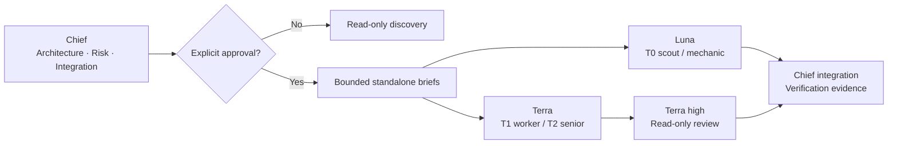

# Chief Engineer for Codex

> A cost-aware engineering orchestration skill for Codex: keep architecture and
> accountability with the chief, then dispatch bounded work to the cheapest
> model that can safely do it.

[](LICENSE)
[](skill/chief-engineer/SKILL.md)

`chief-engineer` turns multi-workstream engineering tasks into a controlled
workflow with explicit approval, model routing, isolated worker briefs, and
evidence-based integration. It is designed to reduce total cost without
delegating architecture, safety, or final accountability.



## What it enforces

| Concern | Policy |
|---|---|
| Architecture and red-line decisions | Chief-only; never delegated to a worker |
| Routine execution | Model-pinned Luna or Terra workers with a standalone brief |
| Code review | Read-only Terra reviewer; use an independent external reviewer for cross-model QA |
| Approval | Write workers require an explicit, brief-bound approval record |
| Write boundary | A local, ignored allowlist of approved Git repository roots |
| Write isolation | Every write worker uses a dedicated project-local linked worktree and lock |
| Privacy | Run artifacts stay local; the optional token report hides task titles by default |

## Quick start

Requirements: Codex CLI, Git, Bash, `jq`, Python 3, and either `shasum` or
`sha256sum`, plus the model IDs used by your account.

```bash
git clone https://github.com/himraven/codex-chief-engineer.git
cd codex-chief-engineer
./install.sh --dry-run
./install.sh
```

The installer is deliberately non-destructive: it refuses to overwrite an
existing skill or agent configuration.

## Configure the local write boundary

The package installs with an empty allowlist. This is intentional: no
write-capable worker can run until you add a narrow Git repository root.

```bash
export CODEX_HOME="${CODEX_HOME:-$HOME/.codex}"
$EDITOR "$CODEX_HOME/skills/chief-engineer/references/approved-repo-roots.local.txt"
```

Add one canonical repository root per line, for example:

```text
/absolute/path/to/your/repository
```

The local file is ignored by Git. Never commit personal paths, generated
worker artifacts, JSONL event logs, or token-report output.

Write-capable workers must also run in a dedicated linked worktree beneath the
allowlisted repository, for example:

```bash
git -C /absolute/path/to/your/repository worktree add \
  /absolute/path/to/your/repository/.worktrees/worker-1 -b agent/worker-1
```

## Use the skill

Ask Codex to use `$chief-engineer` for a multi-workstream task. The chief will
inspect reality, design the solution, present a dispatch table, and wait for
your explicit approval before write-capable work begins.

For an approved standalone worker, use the installed adapter:

```bash
CE="${CODEX_HOME:-$HOME/.codex}/skills/chief-engineer"
"$CE/scripts/ce-dispatch.sh" \
  --role worker \
  --cwd /absolute/path/to/your/repository/.worktrees/worker-1 \
  --brief /absolute/path/to/brief.md \
  --approval-file /absolute/path/to/write-approval.md \
  --result-dir /absolute/path/to/local-results
```

Use the included [worker brief template](skill/chief-engineer/references/worker-brief.md).
After a human explicitly approves the write, create the
[approval record](skill/chief-engineer/references/write-approval.md) with the
brief SHA-256. The adapter refuses write dispatch without a matching record,
Sol as a worker, non-Git directories, shared checkouts, roots outside the local
allowlist, and oversized briefs.

## Model routing

The bundled defaults use the GPT-5.6 family available to the original setup.
Edit both the skill table and `agents/` TOML files if your Codex account exposes
different model IDs.

| Tier | Role | Default model / effort |
|---|---|---|
| T0 | Scout and mechanic | Luna / low |
| T1 | Bounded implementation | Terra / medium |
| T2 | Cross-file implementation | Terra / high |
| Review | Read-only code review | Terra / high |
| T3 | Architecture and integration | Sol / xhigh |

The `agents/` directory provides optional custom-agent definitions. The direct
dispatch adapter is the portable path when a surface cannot prove exact child
model selection, sandbox narrowing, and transcript isolation.

## Optional token observability

`ce-token-report.py` reads the local Codex state database in read-only mode and
summarizes usage, model routing, and guardrail alerts. It prints anonymous task
identifiers by default rather than task titles or prompts.

```bash
python3 "$CE/scripts/ce-token-report.py" --date 2026-07-11
```

Use `--include-titles` only when it is safe for those local titles to appear in
your terminal output. The script never uploads data, but its output is still
local operational data and must not be committed.

## Privacy and security design

- No account credentials, repository names, home-directory paths, or private
  project policy are included in this repository.
- The local repository allowlist is created after installation and is ignored.
- Dispatch logs, manifests, JSONL events, local environment files, and Python
  caches are ignored.
- The adapter uses an explicit model pin and sandbox for every worker, then
  emits a local manifest for verification.

## Repository layout

```text
skill/chief-engineer/   Installable Codex skill, references, and adapters
agents/                 Optional custom-agent TOML definitions
install.sh              Non-overwriting installer
```

## License

[MIT](LICENSE)
