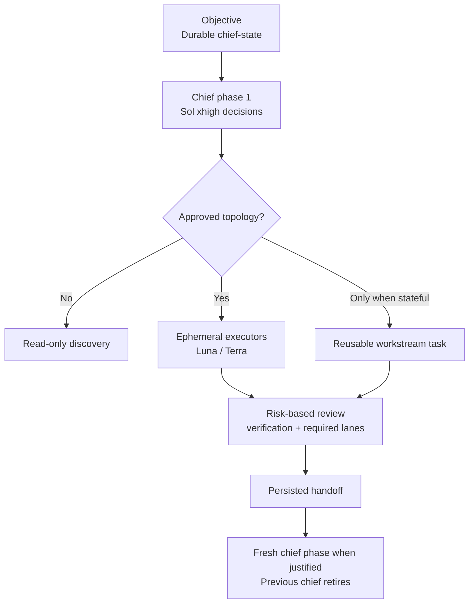

# Chief Engineer for Codex

> Made by GPT-5.6 Sol.

> A quality-preserving lifecycle orchestration skill for Codex: keep
> architecture and accountability with Sol, preserve decisions outside the
> live context, and route bounded execution to the right model.

[](LICENSE)
[](skill/chief-engineer/SKILL.md)

`chief-engineer` treats Sol as the architect, not the execution pool. Sol owns
design, decomposition, risk, task topology, and final convergence. Luna and
Terra execute bounded briefs; their output remains untrusted until verified.

The skill reduces waste through context isolation and right-sized execution,
not shorter briefs, weaker review, or lower reasoning on chief decisions.
The installable `SKILL.md` keeps that doctrine compact; invocation and
substrate mechanics live in an operations reference loaded only when needed.



## What it enforces

| Concern | Policy |
|---|---|
| Chief boundary | Sol holds decisions, not routine execution or unlimited history |
| Architecture and red-line decisions | Chief-only; never delegated to a worker |
| Session lifecycle | One active chief; a fresh phase replaces it at a real boundary |
| Task topology | Visible phase/workstream tasks require approval and are reused, not multiplied |
| Compaction | Health signal only; never an automatic “create task” trigger |
| Routine execution | Model-pinned Luna or Terra workers with a sufficient standalone brief |
| Review intensity | Semantic risk and impact, never LOC |
| Normal semantic code | Focused read-only Terra high review by default (recorded reviewer fallback only after verified availability failure) |
| High-risk change | Chief risk/contract confirmation, targeted independent cross-model challenge, the focused reviewer lane above, then final GitHub review |
| Review repair | Re-verify fixes that can change logic, contracts, configuration, policy, machine-consumed docs, generated output, or runtime behavior; skip only when none can change, and re-verify when uncertain |
| PR closure | Appropriate deterministic verification/CI and one clean cumulative GitHub Codex bot review whose recorded head SHA equals the merge-candidate tip |
| Approval | Write workers require an explicit, brief-bound approval record |
| Repository boundary | Every adapter role is limited to a local allowlist of Git roots |
| Write isolation | Every write worker uses a dedicated project-local linked worktree and lock |
| Repeated work | Unchanged successful input is rejected unless new evidence is recorded |
| Observability | Exact daily turn usage; reasoning is never double-counted |
| Privacy | Run artifacts stay local; task titles are hidden by default |

## Quick start

Requirements: Codex CLI, Git, Bash, `jq`, Python 3.9+, and either `shasum` or
`sha256sum`, plus the model IDs used by your account.

```bash
git clone https://github.com/himraven/codex-chief-engineer.git
cd codex-chief-engineer
./install.sh --dry-run
./install.sh
```

The installer is deliberately non-destructive: it refuses to overwrite an
existing skill or agent configuration.

## Configure the local repository boundary

The package installs with an empty allowlist. This is intentional: no
adapter-based role—including a read-only scout or reviewer—can run until you
add a narrow Git repository root. The boundary prevents accidental access to a
home directory or unrelated checkout.

```bash
export CODEX_HOME="${CODEX_HOME:-$HOME/.codex}"
$EDITOR "$CODEX_HOME/skills/chief-engineer/references/approved-repo-roots.local.txt"
```

Add one canonical repository root per line, for example:

```text
/absolute/path/to/your/repository
```

The local file is ignored by Git. Never commit personal paths, generated
worker artifacts, JSONL event logs, or token-report output.

After allowlisting the main repository, write-capable workers must additionally
run in a dedicated linked worktree beneath it, for example:

```bash
git -C /absolute/path/to/your/repository worktree add \
  /absolute/path/to/your/repository/.worktrees/worker-1 -b agent/worker-1
```

## Use the skill

Ask Codex to use `$chief-engineer` for a multi-workstream task. The chief will
inspect reality, design the solution and task topology, then wait for explicit
approval before write-capable work begins.

The lifecycle has three levels:

- **Objective:** one durable outcome and one persisted `chief-state`.
- **Phase:** one active Sol decision context. A fresh phase starts only at a
  natural boundary or verified context-health failure and replaces the old one.
- **Workstream:** one bounded ownership lane. Keep a visible task only when it
  needs repeated future exchanges; ordinary workers stay ephemeral.

A compaction does not create a task. A small objective normally uses one chief
task, a medium objective one or two sequential phases, and a genuinely large
objective two to four named phases across its lifetime—not hundreds of
sessions. Outside a natural phase boundary, compaction or high context must be
paired with observed quality degradation before rollover. When the active Codex
surface supports task messaging, reuse the same workstream task and follow it
with compact waits. Do not fork a long history and call that a context reset.

For an approved standalone worker, use the installed adapter:

```bash
CE="${CODEX_HOME:-$HOME/.codex}/skills/chief-engineer"
"$CE/scripts/ce-dispatch.sh" \
  --role worker \
  --objective-id OBJ-001 \
  --phase-id P2-implementation \
  --workstream-id WS-api \
  --cwd /absolute/path/to/your/repository/.worktrees/worker-1 \
  --brief /absolute/path/to/brief.md \
  --approval-file /absolute/path/to/write-approval.md \
  --result-dir /absolute/path/to/local-results
```

Use the included [worker brief template](skill/chief-engineer/references/worker-brief.md).
After a human explicitly approves the write, create the
[approval record](skill/chief-engineer/references/write-approval.md) with the
brief SHA-256. The adapter refuses write dispatch without a matching record,
Sol as a worker, non-Git directories, shared checkouts, roots outside the local
allowlist, oversized briefs, and result directories inside the repository.
Keeping `--result-dir`, `CE_RUN_HOME`, and `CODEX_HOME` outside the repository
prevents adapter artifacts from becoming new evidence. The adapter also
fingerprints the objective/workstream identity, brief, commit, and repository
state, plus the canonical repository root and effective working directory.
Deduplication intentionally excludes the phase ID: unchanged evidence remains
unchanged after a phase rollover, while an identical brief aimed at another
repository or subdirectory remains a distinct dispatch. Repository state
includes tracked and untracked files—including untracked regular-file
modes—plus dirty state inside initialized submodules. The operational
`.worktrees/` container is excluded from the primary checkout's untracked
evidence; each linked worktree is fingerprinted when it is the dispatch target.
Final diff fingerprints stay relative to the tree captured at dispatch, even
when an executor commits before returning. Repeating an unchanged input requires
a non-blank `--repeat-reason` with the new evidence or question.

Ignored files are deliberately outside automatic repository fingerprinting:
hashing caches, dependencies, build output, and secrets would be expensive and
unsafe. If an ignored artifact affects an executor decision, put its digest in
the reviewed brief; if it changes later, update that digest or provide a
non-blank `--repeat-reason`.

The brief ceiling is a runaway guardrail, not a quality target. Keep every
decision and contract the executor needs; remove copied conversation and raw
logs. If a brief contains multiple objectives, reslice it.

For dispatch flags, review invocation details, and usage-report mechanics, read
[`references/operations.md`](skill/chief-engineer/references/operations.md).
The adapter's `--help` remains authoritative for its interface.

## Model routing

The bundled defaults use the GPT-5.6 family available to the original setup.
Edit the skill table and matching write-capable `agents/` TOML files if your
Codex account exposes different model IDs.

| Tier | Role | Default model / effort |
|---|---|---|
| T0 | Scout and mechanic | Luna / low |
| T1 | Bounded implementation | Terra / medium |
| T2 | Cross-file implementation | Terra / high |
| Review | Read-only code review | Terra / high |
| T3 | Architecture and integration | Sol / xhigh |

The `agents/` directory provides optional native definitions only for mechanic,
worker, and senior write roles. Native ephemeral agents are suitable for those
roles when the active surface proves the requested role, model, reasoning
effort, sandbox, and fresh-context behavior. Scouts and reviewers are not
shipped as native definitions and always use the adapter because their
read-only boundary must be enforced by a real sandbox. The direct dispatch
adapter is the portable fallback for other roles when any required property is
not observable. An older installation that still contains `ce-scout.toml` or
`ce-reviewer.toml` under `CODEX_HOME/agents` must move those files out before
installing this policy; the installer fails closed while either remains.

## Review lifecycle

Review is risk-based, not a fixed stack repeated for every change. All candidate
PRs receive the checks that prove their changed surface and a final clean
cumulative GitHub Codex bot review whose recorded head SHA equals the
merge-candidate tip. Any new candidate commit invalidates the prior GitHub
clean. Normal semantic code changes also receive one focused, read-only Terra
high review by default; the recorded reviewer fallback applies only after
verified availability failure.

After a review fix, targeted re-verification is required when the change can
affect logic, contracts, configuration, policy, machine-consumed docs, generated
output, or runtime behavior. Skip only when none can change; if uncertain,
re-verify. Deterministic checks still follow their proof surface, and the final
GitHub clean must bind the new head.

High-risk changes—money, external user behavior or API, security/privacy,
durable-data truth, deployment/release, first release, and review-policy
changes—add chief-owned risk and contract confirmation plus a targeted
independent cross-model challenge and the focused Terra lane above. That
challenge tests the named risk or contract; it is not a duplicate generic
full-diff review. The chief classifies
semantic risk, defines impact cones and review questions, and decides which
lanes or evidence a change invalidates. The cone accounts for every changed
path/area and affected behavior/contracts; path groups/globs and concise
reasoned exclusions are enough. An unexplained changed path expands the cone
and invalidates relevant lanes or triggers high-risk reclassification. Workers
and reviewers may surface risk but cannot self-downgrade required lanes. The
chief inspects the candidate diff/artifact enough for risk, scope, contract, and
evidence checks; this is not an implementation-correctness review and cannot
replace Terra, cross-model, or GitHub review. Claude roles: Haiku 4.5 handles
mechanical sweeps only; Sonnet 5 handles bounded implementation/tests/debugging;
Opus 5 handles senior cross-file execution plus eligible independent
review/challenge. Fable 5 is the Claude-side interactive chief for
architecture/risk/RCA on the Claude surface. In a Codex run, Fable has no chief
role: it may provide only non-binding architecture/risk/RCA advice or a named,
non-binding challenge to Sol; Sol remains the sole active chief and decision
owner for that Codex run. Fable is never an executor or review-throughput
target. Any Claude lane
requires Anthropic to be permitted by repository/data policy or explicit owner
authorization. A Claude review, including Opus 4.8 fallback, is independent
only when Claude did not author the affected change, including Claude-owned
design/contract decisions. The focused Terra review and targeted cross-model
challenge are distinct lanes and cannot be satisfied by the same review. If
Claude is ineligible because it authored the affected change or Anthropic lacks
that authorization, record the ineligibility and route the separate targeted
challenge to an authorized non-authoring provider (normally pinned Grok 4.5),
or defer if no authorized provider is available. For an eligible Claude review,
use a fresh non-resumed read-only turn in safe mode with no redelegation, no
subagents, web, MCP, or writes. Default to a tool-less stdin review packet
containing only the authorized/redacted named question, diff/context, and exact
evidence contract. Safe mode disables CLAUDE.md/skills/plugins/hooks/MCP/custom
agents and no-session-persistence prevents resume. If quality genuinely requires
Read/Grep/Glob, use an OS/filesystem sandbox or projection exposing only the
authorized cone; only then
add paired `--tools "Read,Grep,Glob"` and `--allowedTools "Read,Grep,Glob"`.
Prompt-only path restrictions are not access control and must not authorize a
partial repo. Request every finding with confidence and severity, stay inside
the authorized chief-bound cone, and use listed reproduced results without
generic double-check/re-verify reruns. Its
availability order is Opus 5, then separately verified Opus 4.8 at high effort,
then authorized Grok 4.5; Grok never writes, tests, or debugs. Grok receives
only the minimum redacted non-secret context and only when repository/data
policy or explicit owner
authorization permits that provider; otherwise it is unavailable. Record every
verified failure, ineligibility, and fallback. If no approved/authorized
independent reviewer is available, defer the work and leave high-risk/review-
policy closure incomplete.

Review findings and claimed evidence are checked before acceptance. A concise
plain-text review summary records the base and head SHA, its question and
impact cone, assumptions, and result/evidence. Focused local/cross-model lanes
may carry to a later candidate tip only when the chief records an
intervening-diff invalidation check showing their bound paths/areas,
behavior/contracts, assumptions, and evidence unchanged; otherwise they rerun.
Deterministic checks follow their proof surface. GitHub clean never carries
across a new candidate commit. Batch fixes before asking for the final GitHub
review again; clean required lanes on the same candidate SHA end review.

## Optional token observability

`ce-token-report.py` reads local Codex rollouts and manifests in read-only mode.
It attributes `last_token_usage` to the day each turn actually occurred,
separates cached from uncached input, and reports reasoning as a subset of
output. This avoids the common errors of assigning a thread's lifetime total to
its most recent day or adding reasoning twice.

```bash
python3 "$CE/scripts/ce-token-report.py" --date 2026-07-11
python3 "$CE/scripts/ce-token-report.py" \
  --date 2026-07-11 \
  --objective-id OBJ-001
```

The report follows the absolute `CE_RUN_HOME`, matching the dispatch adapter.
Relative environment paths are rejected so dispatch and reporting cannot
silently resolve different indexes. Use `--run-home` to inspect a different
local manifest index explicitly.

Direct-run gates use execution-time overlap across the full manifest index, so
a run crossing local midnight is visible on both days. Because ephemeral JSONL
events do not carry per-event timestamps, aggregate direct-run tokens are
counted once on the local completion day rather than guessed or double-counted.

Use `--include-titles` only when it is safe for those local titles to appear in
your terminal output. Historical compaction and long-context signals are
advisory: they can justify a fresh phase but never create one automatically or
block unrelated work. The general report does not evaluate a blocking gate.
Add `--objective-id` to gate the next wave for one objective; only its failed
dispatches, invalid manifests, unchanged repeats, budget violations, and
concurrent write fan-out above two across all of its phases make the report
exit nonzero. Phase rows remain diagnostic; a mistaken or incomplete rollover
cannot hide objective-wide write concurrency. This is an explicit pre-wave
check, not an automatic adapter hook: the chief or caller must run it and stop
on failure.

## Privacy and security design

- No account credentials, repository names, home-directory paths, or private
  project policy are included in this repository.
- The local repository allowlist is created after installation and is ignored.
- Dispatch logs, manifests, JSONL events, local environment files, and Python
  caches are ignored.
- The adapter uses an explicit model pin and sandbox for every worker, then
  emits a local manifest for verification.

## Repository layout

```text
skill/chief-engineer/   Installable doctrine, on-demand operations, and adapters
agents/                 Optional write-capable custom-agent TOML definitions
install.sh              Non-overwriting installer
```

## Development

The repository keeps verification intentionally small and local:

```bash
bash -n install.sh skill/chief-engineer/scripts/ce-dispatch.sh
shellcheck install.sh skill/chief-engineer/scripts/ce-dispatch.sh
ruff check skill/chief-engineer/scripts/ce-token-report.py tests
ruff format --check skill/chief-engineer/scripts/ce-token-report.py tests
python3 -m unittest -v
```

Pull requests run the same regression suite in GitHub Actions.

## License

[MIT](LICENSE)
